# dd\_performances
## DeepDetect performance report

This report documents the performances of the [DeepDetect](https://deepdetect.com/) Open Source Deep Learning server on a variety of platforms and popular or particularly effective neural network architectures. The full server source code is available from <https://github.com/beniz/deepdetect>.

The reported performances use a customized version of [Caffe](https://github.com/beniz/caffe) as backend.

### Reference platforms
Given different platforms, the result should serve as a reference for parties and users interested in choosing the right NN model for their work on their server or embedded systems.

Ordered from most to less powerful:

- NVidia GTX 1080 Ti
- NVidia Jetson TX1
- NVidia Jetson Nano
- NVidia Jetson TK1
- Raspberry Pi 3

Note that the 1080Ti and TX1 use the CuDNN NVidia accelerator library, while the TK1 uses GPU implementation without CuDNN and Raspberry uses CPU only.

For a detailed description of all platforms, see the dedicated [platform section](#Platforms).

### Reference networks
We conducts an experiment with multiple contemporary Neural Networks (NN) models.

- GoogleNet
- VGG16 and VGG19
- Resnet 50, 101 and 152
- Densenet 121 and 201
- Squeezenet v1.0 and v1.1
- Mobilenet (original Caffe version and another with custom speed-up)
- Shufflenet

#### FLOPS and Parameters

One important aspect of choosing a model is the limitation of the hardware, such as the computational output (in flops), and the amount of available RAM. The number of flops required for a single pass for a model is displayd below, along with the number of parameters (weights in the network).

<table style="width=100%">
  <tr>
     <th>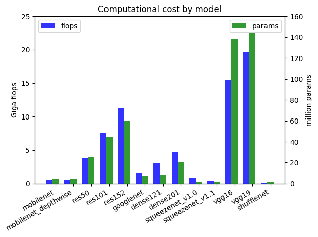</th>
     <th>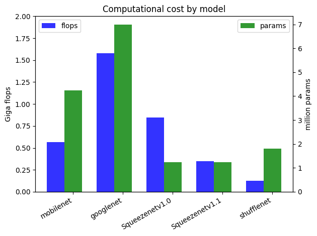</th>
  </tr>
</table>


### Results Overview

Below are performances, displayed in log scale.

<table style="width=100%">
  <tr>
     <th>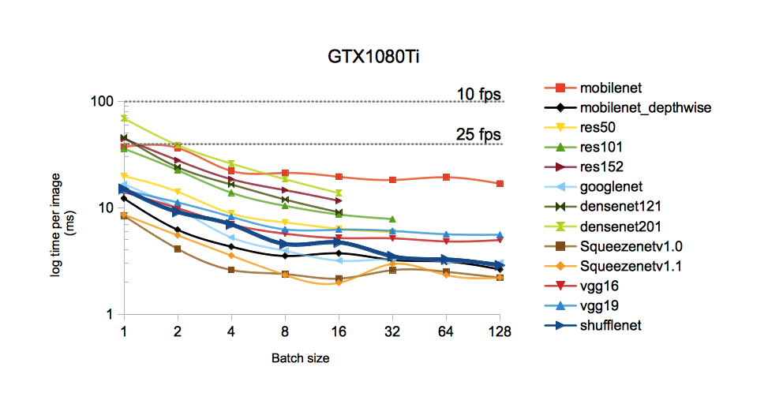</th>
     <th></th>
  </tr>
</table>
<table style="width=100%">
  <tr>
     <th></th>
     <th></th>
  </tr>
</table>
<table style="width=100%">
 <tr>
    <th>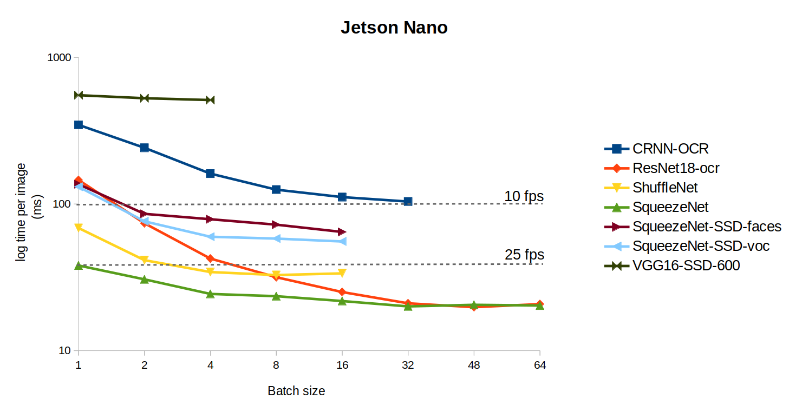</th>
 </tr>
</table>
The reported performances are per image in ms. When batch size is greater than one, the reported value is the average time per image for that batch size. On GPUs and platforms with limited memory, not all batch sizes are applicable.

### Discussion

- All considered networks are tested over image classification tasks, we may add more tasks to the benchmark in the future.
- There's basically an order of magnitude difference in performance in between each platforms taken in decreasing performance order. 
- We seek the best architectures for embedded systems: Squeezenet, Shufflenet, Mobilenet and GoogleNet appear to be the most suited. We use the 10fps and 25fps thresholds as markups for potential real-time applications (with potential batch size > 1).
- We use an improved depthwise convolutional layer in order to boost the performances of the Mobilenet and Shuffletnet architectures. This new layer is available from our custom version of [Caffe](https://github.com/beniz/caffe) alongside many other improvements and features.
- Squeezenet v1.1 appears to be the clear winner for embedded platforms. More analysis of low parameters versions of MobileNet could prove competitive despite the grouped convolutions.


## Platforms
- Desktop GTX1080Ti (11.3 TFLOPS 3585 cores)

  On a Desktop with GTX1080Ti most models are able to perform better than 25 fps. 
  The card has 11 GB GDDR5X VRAM with 3584 CUDA cores running at a maximum of 1582 MHz. 
  This amounts to 11.3 TFLOP/s. While it is capable of real time processing, the power consumption is not viable for embedded system application. 
  Weighting in at 280 watts under load, the Desktop setup is suitable for analysis application, surveillance, anything a desktop would do but no embedded applications.


<details>
  <summary>see linear plot</summary>

  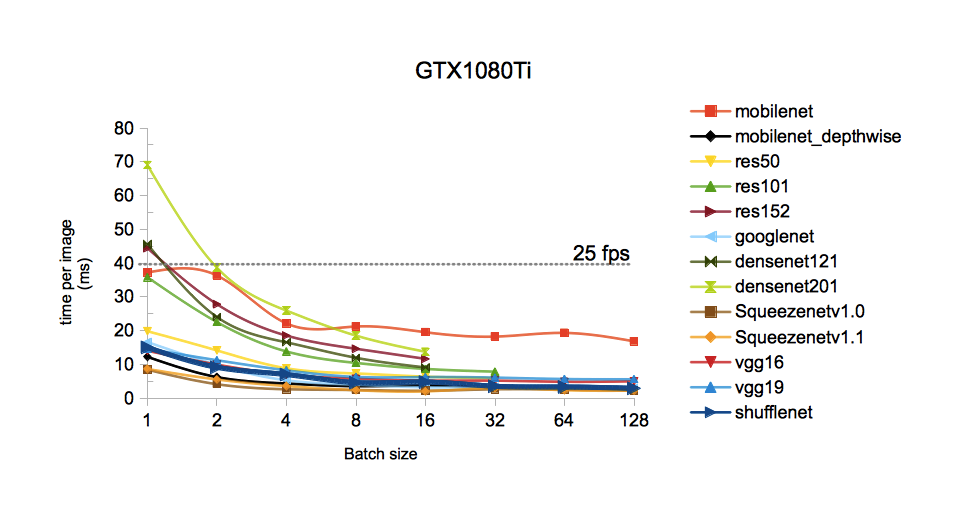

</details>

- Jetson TX1 (1 TFLOPS 256 cores)

  Second on the list is the Nvidia Jetson TX1. Weighting in at 15 W max while in operation, TX1 is a great candidate for embedded system applications. 
  At 1 TFLOPS theoritical output, TX1 is able to push squeezenet\_v1.0, squeezenet\_v1.1, mobilenet\_depthwise, googlenet, and shufflenet to more than 25 fps.
  In extreme cases, Tx1 can compute up to 85 fps with batch-size equal or more than 16 for squeezenet\_v1.1. For a project with critical time constraint 
  such as autonomous cars, 
  TX1 could prove to be viable solution.     


<details>
  <summary>See linear-scale plot</summary>

  

</details>

- Jetson Nano (500 GFLOPS 128 cores)

  Weighting in at 5 W max while in operation, Nano is a low cost solution for embedded system applications and IA on edge. 
  It has a 500 GFLOPS output. For a batch size of 1, ShuffleNet and SqueezeNet reach respectively 12 and 25 fps. 
  Jetson Nano can push up to 10 fps with a batch-size superior or equal to 2 for Squeezenet-SSD-faces, SqueezeNet-SS-voc and ResNet18-ocr.
  When pushed to a 64 batch size, the Nano can compute up to 48 fps for SqueezeNet and ResNet18-ocr. For a large-scale project or one with budget-constraints 
  Jetson Nano seems to be an interesting solution.     


<details>
  <summary>See linear-scale plot</summary>

  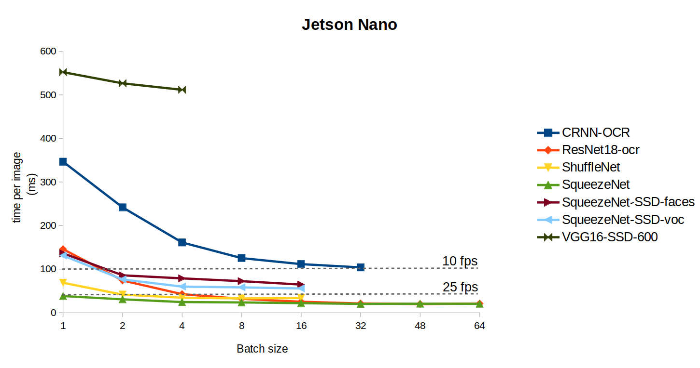

</details>


- Jetson TK1 (300 GFLOPS 192 cores)

  With 12.5 watts rated under load on the development board -should be lower on the module, claimed NVIDIA- and the cost of 200 USD, 
  The Jetson TK1 seems to hit the sweet spot for computational power vs cost for embedded application.
  Given a proper optimization, the TK1 could reach 25 fps in term of processing speed.
  The TK1 would serve well in general purpose image classification in manufacturing processes, surveillance, and replacing workforce in non-safety-critical tasks. 


<details>
  <summary>See linear-scale plot</summary>

  

</details>

- Raspberry Pi3 model B (24GFLOPs GPU and 2.3 DMIPS/MHz CPU at 35 USD)

  The last in our book is the Raspberry Pi3. At merely 4 watts under load, the Pi ought to be the preferred solution for remote sensing.
  The downside lies in its ability to process images, at merely 1 fps max performance.  


<details>
  <summary>See linear-scale plot</summary>

  

</details>

## Networks comparison across platforms
The results of the comparison of each model accross multiple platform are displayed below.
The legend shows the number of batch size in color coded manner. Note that not all batch sizes are available for all architectures.

<details>
  <summary>see all plots..</summary>

  
  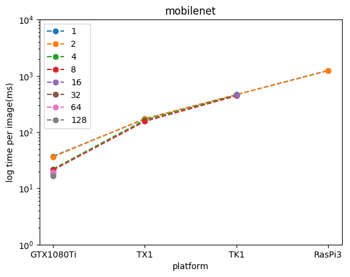
  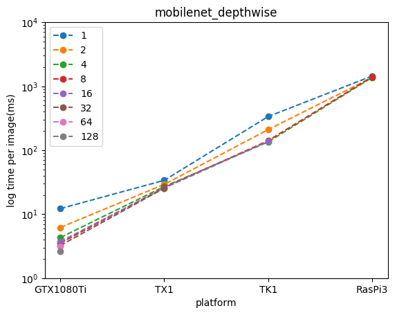
  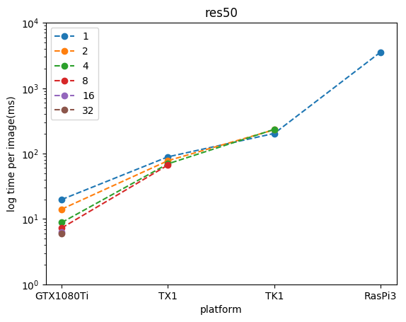
  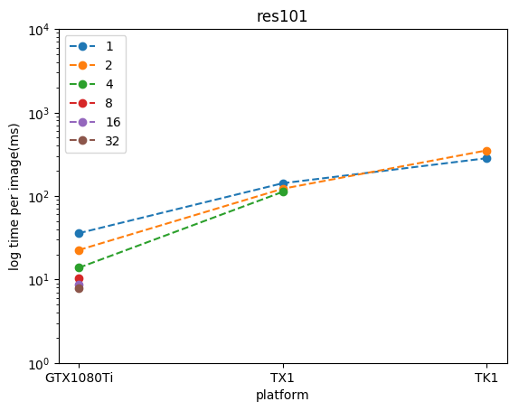
  
  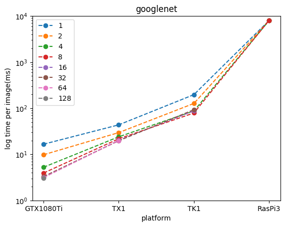
  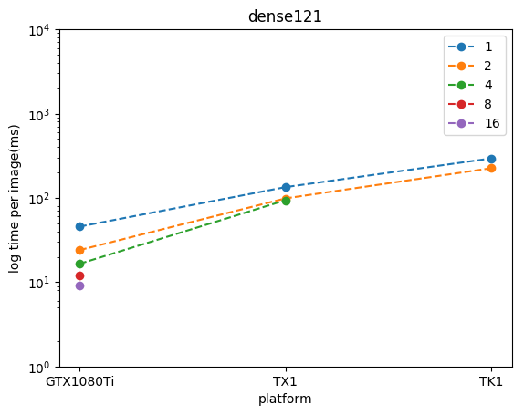
  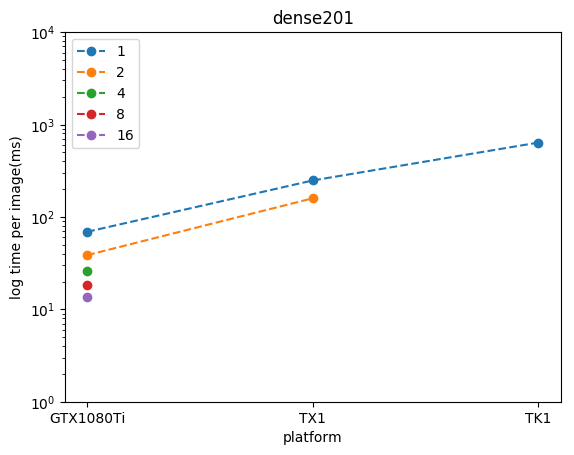
  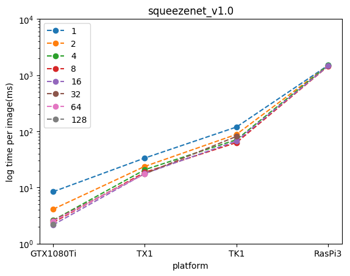
  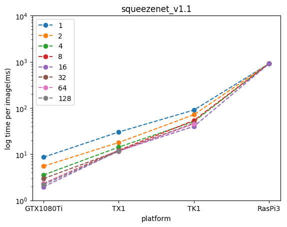
  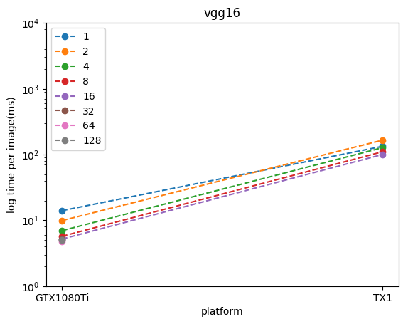
  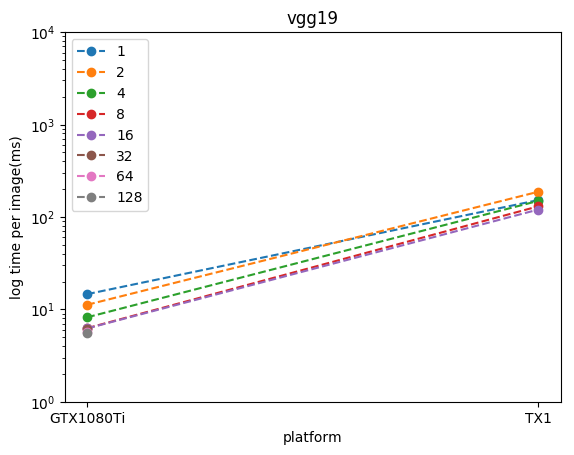
  

</details>

## Selecting an embedded platform and network

The challenge of implementing NN on an embedded system is the limitation on memory and computational resources.

That is to say it should have a small computational trace without losing the accuracy. To this purpose we looked into three rather novel architectures: SqueezeNet, MobileNet and ShuffleNet.

<!-- We looked into <a href =  >Mobilenet</a>. -->

#### MobileNet

Mobilenet is an implementation of [Google's MobileNet](https://arxiv.org/abs/1704.04861). 
Mobilenet has Top-1 accuracy of 70.81% and Top-5 accuracy of 89.5% compared to the leading model in accuracy, Densenet201, with 77.31% for Top-1 and 93.64% for Top-5. The MobileNet architecture has shown rather minimal lost in accuracy while reducing the footprint from 4.7 Gflops to 0.56 Gflops.

But the result was rather underwhelming. While faster than densenet201, the mobilenet is nowhere near the leading models in term of speed. The reason lies with the vanilla implementation of `grouped convolutions` in Caffe. A dedicated rewrite of depthwise convolutions (modified from <https://github.com/BVLC/caffe/pull/5665>) yielded an order of magnitude speed-up, making MobileNet usable again.

Our baseline was customized from <https://github.com/shicai/MobileNet-Caffe>.

You can witness the performance gain from the naive MobileNet implementation with vanilla Caffe below. On CPU

<table style="width=80%">
  <tr>
     <th>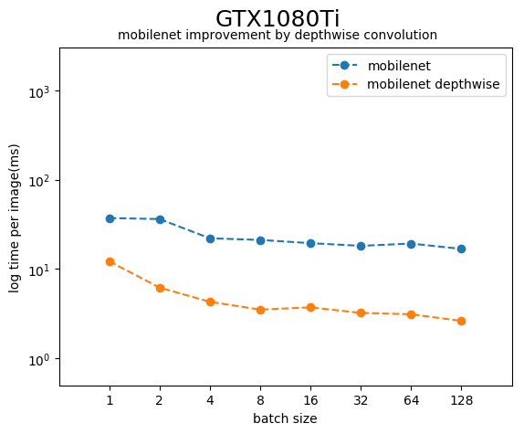</th>
     <th>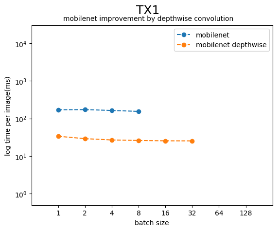</th>
  </tr>
</table>
<table style="width=80%">
  <tr>
     <th>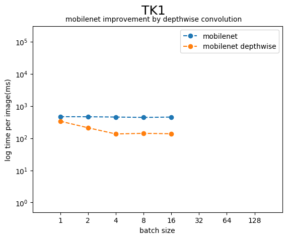</th>
     <th>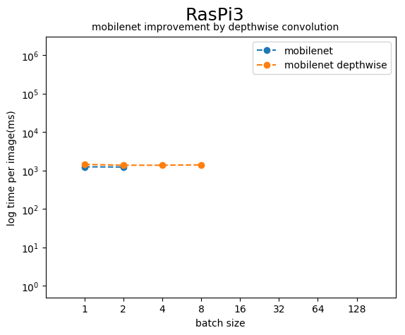</th>
  </tr>
</table>

The gain is negligible on the Raspberry Pi 3 pure CPU platform. On GPU platforms the gain improves with batch size.

#### ShuffleNet

The [ShuffleNet](https://arxiv.org/abs/1707.01083) promised a more efficient NN via the dephtwise convolutions and a dedicated shuffling of channels.

We used a customized implementation from <https://github.com/farmingyard/ShuffleNet>, and that exhibit good performances.


## Methodology
### benchmarking
  The benchmark uses the [dd_bench.py](https://github.com/beniz/deepdetect/blob/master/clients/python/dd_bench.py) Python script with images that can be downloaded from <https://deepdetect.com/stuff/bench.tar.gz>.
  
  Assuming you had successfully build DeepDetect and it's up and running, the following call to the benchmark tool was used:
  
  ```
  python dd_bench.py --host localhost --port 8080 --sname imageserv --gpu --remote-bench-data-dir <bench folder's location> --max-batch-size 128 --create <NN model folder name>
  ```

  Of course, you'd need to change &lt;bench folder's location&gt; to your location to the bench folder and &lt;NN model folder name&gt; to your model folder name or path, assuming it is saved under DeepDetect/models.

  This will create a service on the DD server with the name of `imgserv` with server listening from localhost:8080. It will use the available GPU according to `--gpu` and will make attempts of increasing batchsize up to 128.
 
* Note attempting to create a service while it has already been created will result in errors. You can remove `--create &lt;model name&gt;` to avoid this issue.
  To automatically kill the service after benchmarking add `--auto-kill`. For more information run `python dd\_bench.py --help`

### Using additional models
To use additional models for benchmarking, 2 files are needed, 
- model.caffemodel 
- deploy.prototxt
The former is a structure representation of the network while the later holds the trained weight as the model.

To train your own model beforehand, please refer to the section <a href="https://www.deepdetect.com/overview/train_images/">here</a>.

For the `prototxt` file taken from other resources, we need to make sure that the input and output are compatible with DeepDetect.

In the general case we will add the first layer to take the input as 224x224 image and on the output we will add a layer to treat the output with softmax. A useful reference template is <https://github.com/beniz/deepdetect/blob/6d0a1f2d1e487b492e004d7d5972f302d4182ab1/templates/caffe/googlenet/deploy.prototxt>

</details>

## Raw Data

<details>

### 5 pass average processing time(GTX 1080 Ti):
|Top 1 accuracy	|70.81	|missing	|75.3	|76.4	|77	|67.9	|74.9	|77.3	|59.5	|59.5	|70.5	|71.3	|missing|
| :---: | :---: | :---: | :---: | :---: | :---: | :---: | :---: | :---: | :---: | :---: | :---: | :---: | :---: |
|batch size	|mobilenet	|mobilenet\_depthwise	|res50	|res101	|res152	|googlenet	|densenet121	|densenet201	|Squeezenetv1.0	|Squeezenetv1.1	|vgg16	|vgg19	|shufflenet|
|1	|37.2	|12.2	|19.8	|35.8	|44.4	|16.6	|45.6	|69	|8.4	|8.6	|14	|14.6	|15	|
|2	|36.3	|6.2	|14.1	|22.5	|27.8	|9.8	|24	|38.6	|4.1	|5.5	|9.9	|11.2	|9.1	|
|4	|22.1	|4.3	|8.8	|13.8	|18.5	|5.25	|16.5	|25.9	|2.6	|3.55	|6.95	|8.2	|6.95	|
|8	|21.2	|3.52	|7.27	|10.4	|14.6	|3.93	|11.92	|18.5	|2.38	|2.33	|5.7	|6.25	|4.55	|
|16	|19.5	|3.73	|6.33	|8.63	|11.6	|3.18	|9.06	|13.7	|2.16	|1.97	|5.18	|6.21	|4.71	|
|32	|18.2	|3.23	|5.9	|7.82	|x	|3.3	|x	|x	|2.59	|2.96	|5.15	|6.05	|3.49	|
|64	|19.3	|3.12	|x	|x	|x	|3.13	|x	|x	|2.5	|2.33	|4.82	|5.63	|3.26	|
|128	|16.8	|2.63	|x	|x	|x	|3.05	|x	|x	|2.2	|2.2	|4.97	|5.57	|2.87	|

### 5 pass average processing time(Jetson TX1):
|Top 1 accuracy	|70.81	|missing	|75.3	|76.4	|77	|67.9	|74.9	|77.3	|59.5	|59.5	|70.5	|71.3	|missing|
| :---: | :---: | :---: | :---: | :---: | :---: | :---: | :---: | :---: | :---: | :---: | :---: | :---: | :---: |
|batch size	|mobilenet	|mobilenet\_depthwise	|res50	|res101	|res152	|googlenet	|densenet121	|densenet201	|Squeezenetv1.0	|Squeezenetv1.1	|vgg16	|vgg19	|shufflenet|
|1	|171	|33.8	|89	|142	|195	|43.6	|134	|248	|33.4	|30.2	|133	|152	|60	|
|2	|173	|29.2	|77.7	|122	|180	|29.6	|98.5	|159	|23.7	|17.9	|165	|187	|38.8	|
|4	|164	|27	|69.6	|112	|x	|24	|93.7	|x	|20.7	|14.2	|127	|149	|21.7	|
|8	|155	|26.1	|66.7	|x	|x	|21.8	|x	|x	|18.6	|12.1	|110	|130	|20.6	|
|16	|x	|25.6	|x	|x	|x	|20.2	|x	|x	|17.7	|11.8	|100	|120	|21.8	|
|32	|x	|25.5	|x	|x	|x	|19.7	|x	|x	|17.5	|11.8	|x	|x	|22.9	|
|64	|x	|x	|x	|x	|x	|20	|x	|x	|17.6	|11.5	|x	|x	|x	|
|128	|x	|x	|x	|x	|x	|x	|x	|x	|x	|11.6	|x	|x	|x	|

### 5 pass average processing time(Jetson TK1):
|Top 1 accuracy	|70.81	|missing	|75.3	|76.4	|77	|67.9	|74.9	|77.3	|59.5	|59.5	|70.5	|71.3	|missing|
| :---: | :---: | :---: | :---: | :---: | :---: | :---: | :---: | :---: | :---: | :---: | :---: | :---: | :---: |
|batch size	|mobilenet	|mobilenet\_depthwise	|res50	|res101	|res152	|googlenet	|densenet121	|densenet201	|Squeezenetv1.0	|Squeezenetv1.1	|vgg16	|vgg19	|shufflenet|
|1	|464	|336	|203	|283	|400	|197	|294	|637	|119	|90.2	|x	|x	|82.8	|
|2	|462	|210	|231	|351	|477	|127	|225	|x	|88	|71.3	|x	|x	|63.8	|	
|4	|453	|135	|234	|x	|x	|87.2	|x	|x	|70.8	|50.9	|x	|x	|53.4	|
|8	|441	|141	|x	|x	|x	|78.8	|x	|x	|62.9	|53.6	|x	|x	|52	|
|16	|452	|137	|x	|x	|x	|87.8	|x	|x	|67	|40	|x	|x	|51.3	|
|32	|x	|x	|x	|x	|x	|93	|x	|x	|81	|46.8	|x	|x	|x      |
|64	|x	|x	|x	|x	|x	|x	|x	|x	|x	|45.2	|x	|x	|x      |
|128	|x	|x	|x	|x	|x	|x	|x	|x	|x	|x	|x	|x	|x      |

### 5 pass average processing time(Raspberry pi 3):
|Top 1 accuracy	|70.81	|missing	|75.3	|76.4	|77	|67.9	|74.9	|77.3	|59.5	|59.5	|70.5	|71.3	|missing|
| :---: | :---: | :---: | :---: | :---: | :---: | :---: | :---: | :---: | :---: | :---: | :---: | :---: | :---: |
|batch size	|mobilenet	|mobilenet\_depthwise	|res50	|res101	|res152	|googlenet	|densenet121	|densenet201	|Squeezenetv1.0	|Squeezenetv1.1	|vgg16	|vgg19	|shufflenet|
|1	|1246	|1443	|3560	|x	|x	|7980	|x	|x	|1492	|910	|x	|x	|1115      |
|2	|1230	|1370	|x	|x	|x	|8008	|x	|x	|1478	|917	|x	|x	|1067      |
|4	|x	|1372	|x	|x	|x	|7943	|x	|x	|1493	|919	|x	|x	|1047      |
|8	|x	|1401	|x	|x	|x	|8015	|x	|x	|1444	|913	|x	|x	|1046      |
|16	|x	|x	|x	|x	|x	|x	|x	|x	|1456	|909	|x	|x	|x      |
|32	|x	|x	|x	|x	|x	|x	|x	|x	|x	|x	|x	|x	|x      |
|64	|x	|x	|x	|x	|x	|x	|x	|x	|x	|x	|x	|x	|x	|
|128	|x	|x	|x	|x	|x	|x	|x	|x	|x	|x	|x	|x	|x	|

### flops and params for each model:
|  | mobilenet |mobilenet\_depthwise |res50 |res101 |res152 |googlenet |densenet121 |densenet201 |Squeezenetv1.0 |Squeezenetv1.1 |vgg16 |vgg19 |shufflenet |
| :---: | :---: | :---: | :---: | :---: | :---: | :---: | :---: | :---: | :---: | :---: | :---: | :---: | :---: | 
| Giga flops	|0.5687 | 0.5514 | 3.8580 | 7.5702 | 11.282 | 1.5826 | 3.0631 | 4.7727 | 0.8475 | 0.3491 | 15.470 | 19.632 | 0.1234|
| million params | 4.2309 | 4.2309 | 25.556 | 44.548 | 60.191 | 6.9902 | 7.9778 | 20.012 | 1.2444 | 1.2315 | 138.34 | 143.65 | 1.8137 |

</details>

The bulk of this work was done by <https://github.com/jsaksris/> while on internship at [jolibrain](http://www.jolibrain.com).


